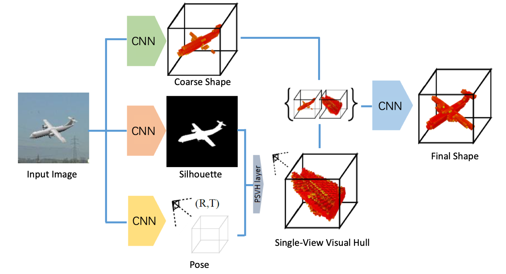
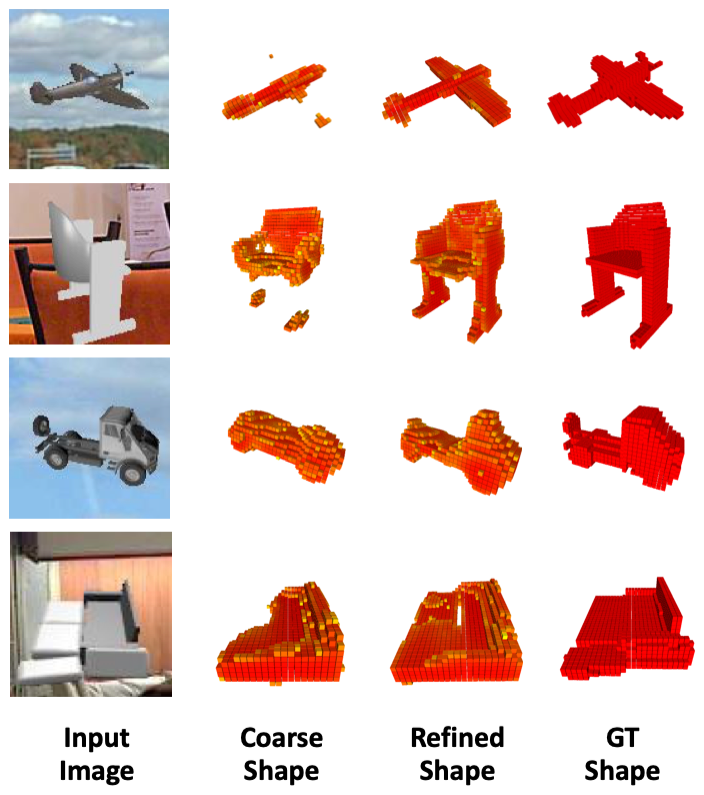

# PSVH-3d-reconstruction
This repository is the implementation of our AAAI 2019 paper:

[Deep Single-View 3D Object Reconstruction with Visual Hull Embedding](https://arxiv.org/pdf/1809.03451.pdf)

[Hanqing Wang](https://hanqingwangai.github.io), [Jiaolong Yang](http://jlyang.org/), [Wei Liang](http://iitlab.bit.edu.cn/mcislab/~liangwei/), [Xin Tong](http://www.xtong.info/)

This work is implemented using [TensorFlow](https://www.tensorflow.org/).
## Introduction
In this paper, we present an approach which aims to preserve more shape details and improve the reconstruction quality. The key idea of our method is to leverage object mask and pose estimation from CNNs to assist the 3D shape learning by constructing a probabilistic single-view visual hull inside of the network. 



Our method works by first predicting a coarse shape as well as the object pose and silhouette using CNNs, followed by a novel 3D refinement CNN which refines the coarse shapes using the constructed probabilistic visual hulls.
<!--  -->
<!--  -->

## Examples


## Citation
If you find our work helpful for your research, please cite our paper:
```
@inproceedings{wang2019deep,
  author = {Wang, Hanqing and Yang, Jiaolong and Liang, Wei and Tong, Xin},
  title = {Deep Single-View 3D Object Reconstruction with Visual Hull Embedding},
  booktitle = {Proceedings of the AAAI Conference on Artificial Intelligence (AAAI)},
  year = {2019}
}

```
## Installation
Install python and the dependencies:
- python `3.5`
- tensorflow `1.12.0`
- pillow

If your python environments are managed via Anaconda/Miniconda, you can install the dependencies using the following scrpit:
``` shell
conda install tensorflow pillow
```
In our paper, we trained two network for rendered images and real images respectively. The checkpoint of the trained models are available [here](https://drive.google.com/file/d/10sXBMPc_p2K9Ejl3bSNbFhsS-kzAIs6b/view?usp=sharing)(426MB). Extract the files to the root directory.

## Demo

Run `python run_case.py` to run the examples. The outputs are reconstruction results before and after the refinement (Please refer to our paper for more details). The results are in `obj` format. You can use [meshlab](http://www.meshlab.net/) for visulization.    

## Acknowlegement

Part of this work was done when I was an intern at Microsoft Research Asia. It is impossible to finish without the help of my colleagues and my mentor.

## License
PSVH is freely available for non-commercial use, and may be redistributed under these conditions. Please see the [license](LICENSE) for further details. For commercial license, please contact the authors.
