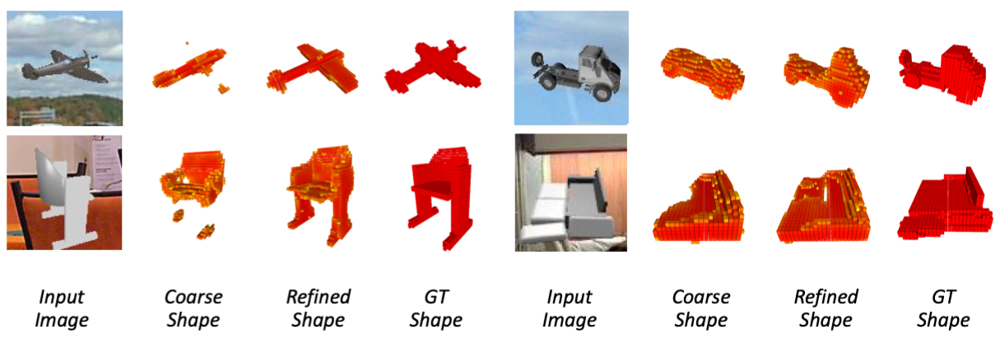

# PSVH-3d-reconstruction
This is the implementation of our AAAI19 paper [Deep Single-View 3D Object Reconstruction with Visual Hull Embedding](https://arxiv.org/pdf/1809.03451.pdf). The authors of this paper are [Hanqing Wang](https://qweas120.github.io), [Jiaolong Yang](http://jlyang.org/), [Wei Liang](http://iitlab.bit.edu.cn/mcislab/~liangwei/) and [Xin Tong](http://www.xtong.info/).

## Introduction

<!--  -->


## Citation
If you find our work helpful for your research, please cite our paper:
```
@article{wang2018deep,
  title={Deep Single-View 3D Object Reconstruction with Visual Hull Embedding},
  author={Wang, Hanqing and Yang, Jiaolong and Liang, Wei and Tong, Xin},
  journal={arXiv preprint arXiv:1809.03451},
  year={2018}
}

```
## Installation
Install python and the dependencies:
- python `3.5`
- tensorflow `1.12.0`
- pillow

If your python environments are managed via Anaconda/Miniconda, you can install the dependencies using the following scrpit:
``` shell
conda install tensorflow pillow
```
The checkpoint of the trained models are available [here](https://drive.google.com/open?id=1TJEUUhmZL8WJgQbsrRX9D_GKAiqE8Gic)(426MB). Extract the files to the root directory.

## Run Example

Run `python run_case.py` to run the examples. The reconstruction are `obj` files. You can use [meshlab](http://www.meshlab.net/) for visulization.

## Acknowlegement


